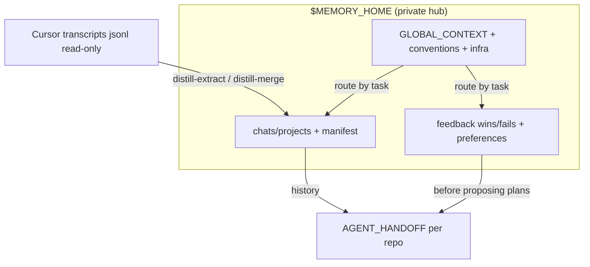

# Cursor Agent Memory

**Version:** 0.8.7 — see [VERSIONING.md](VERSIONING.md) · CI on push/PR · Release on tag ([workflows](.github/workflows/))
Created by [raphaelbatte](https://github.com/raphael-batte) · [raphbatte.com](https://raphbatte.com)

## What this is

**Cursor forgets between sessions.** This is not a notes folder — it is a **routed multi-layer memory system** for AI agents:

- **Global context** — who you are, which projects, cross-repo rules, infra
- **Feedback** — what worked (+) and what to stop proposing (−)
- **Chat memory** — distilled Cursor transcripts into curated project files
- **Handoff** — per-repo «where we stopped» (`AGENT_HANDOFF.md`)

Agents load **one layer per task** (INDEX-first), not everything every time. Scripts extract chats without raw jsonl, verify hub integrity, and remind you at session end.

**Clean dev repo + install clone** — edit framework in a GitHub-clean clone; Cursor and your private hub live in the install clone (`<install>/memory/`, gitignored). MIT license.

→ **Setup:** [ONBOARDING.md](ONBOARDING.md)

→ **System design:** [ARCHITECTURE.md](ARCHITECTURE.md) · **Agent protocol:** [INSTRUCTIONS.md](INSTRUCTIONS.md) · **Human setup:** [MIGRATION.md](MIGRATION.md)

## How layers connect



| Layer | Answers | Location |
|-------|---------|----------|
| Global context | Who? Rules? Projects? Hosts? | `$MEMORY_HOME/context/` |
| Feedback | What +/− worked? How user thinks? | `feedback/`, `preferences.md` |
| Chat memory | What did we discuss/decide? | `chats/projects/<slug>.md` |
| Handoff | What is the **next step now**? | `<repo>/AGENT_HANDOFF.md` |

## Who reads what

| You are… | Start here |
|----------|------------|
| **Human** setting up for the first time | [ONBOARDING.md](ONBOARDING.md) → Quick start below |
| **Human** understanding the design | [ARCHITECTURE.md](ARCHITECTURE.md) |
| **Agent** in Cursor | [INSTRUCTIONS.md](INSTRUCTIONS.md) + `@agent-memory` skill |
| **Contributor** to this framework | [VERSIONING.md](VERSIONING.md) + `tests/run-tests.sh` |

## What is in this repo

| Area | Contents |
|------|----------|
| **Skill** (1 default) | `agent-memory` — internal docs under `skills/*/` |
| **Scripts** | distill, `sync-memory`, verify, doctor, hooks installer |
| **Templates** | Empty hub scaffolds: context, feedback, chats, handoff, Cursor rules/hooks |
| **CI** | Tests on push/PR; pinned gitleaks; GitHub Release on `v*` tag |
| **Tests** | 100+ unit/shell checks including sync, distill links, routing, secrets |

Distill flow in one line: `distill-merge.py <uuid>` → review `merge-staging/` → **semantic-merge** skill → optional `--apply` (Recent only).

## Quick start

```bash
git clone https://github.com/raphael-batte/cursor-agent-memory.git
cd cursor-agent-memory   # any clone path works
bash scripts/link-cursor-skills.sh --force   # one skill: agent-memory
```

`link-cursor-skills.sh` / `init-memory.sh` / `sync-memory.py` record the real clone path in config — install folder name is arbitrary.

In Cursor: add `@agent-memory`, then say **sync with agent memory** (agent runs `sync-memory.py`, asks 180 days + handoff mode). Reload window after hooks install.

Manual sync:

```bash
bash scripts/init-memory.sh
python3 scripts/sync-memory.py --days 180 --handoff-mode optional
```

### Config (`config.json`)

| File | Purpose |
|------|---------|
| `$MEMORY_HOME/config.json` | `framework_root`, `handoff_mode`, optional `linked_skills` |
| `memory/config.json` | `framework_root`, `memory_home`, `handoff_mode` (auto-set on init/link/sync) |

Scripts resolve paths: CLI flag → env → config → default. No `export` every session.

## Two locations

| Path | What | Git |
|------|------|-----|
| `$FRAMEWORK_ROOT/` (this clone) | Skills, scripts, templates, INSTRUCTIONS | **yes** (this repo) |
| `$MEMORY_HOME` | GLOBAL_CONTEXT, feedback, chats, manifest | **never** |

**Never** store secrets in `$MEMORY_HOME`. Distill redacts known patterns; `verify-memory.py` scans the hub.

## Per-project handoff (optional)

When `handoff_mode` is not `off`:

```bash
cp templates/repo-handoff/AGENT_HANDOFF.md /path/to/your-repo/
```

Sync bootstraps Projects in GLOBAL_CONTEXT from distills. Chat files appear under `chats/projects/<slug>.md` automatically.

## Migration, skills, status

```bash
bash scripts/migrate-memory.sh --from /path/to/old-hub --to "$MEMORY_HOME"
bash scripts/skills-status.sh
bash scripts/link-cursor-skills.sh --force
python3 scripts/memory-status.py --brief
```

## Docs map

| File | Audience |
|------|----------|
| [ONBOARDING.md](ONBOARDING.md) | **Humans** — fresh clone, one skill, sync command |
| [ARCHITECTURE.md](ARCHITECTURE.md) | **Humans** — layers, routing, distill pipeline |
| [docs/SYNC-AND-TRIGGERS.md](docs/SYNC-AND-TRIGGERS.md) | **Humans/devs** — hooks, sync pipeline |
| [MIGRATION.md](MIGRATION.md) | **Humans** — migrate hub, advanced workflows |
| [INSTRUCTIONS.md](INSTRUCTIONS.md) | **Agents** — session start/end, rotation, secrets |
| [VERSIONING.md](VERSIONING.md) | Contributors — SemVer, tags, releases |
| [SKILL.md](SKILL.md) | Cursor `@agent-memory` entry |
| [templates/](templates/) | Empty scaffolds |

## Scripts (common)

```bash
python3 scripts/list-chats.py --pending
python3 scripts/distill-extract.py <uuid> --strategy auto
python3 scripts/distill-merge.py <uuid> --strategy auto --memory-home "$MEMORY_HOME"
python3 scripts/distill-merge.py <uuid> --apply --memory-home "$MEMORY_HOME"
python3 scripts/verify-memory.py --memory-home "$MEMORY_HOME"
bash scripts/weekly-verify.sh --dry-run
```

**Tests:** `bash tests/run-tests.sh`

## License

[MIT](LICENSE) — clone, fork, modify freely. Personal framework; contributions welcome.
