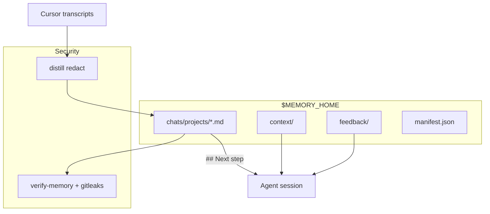

# Agent Memory

## What this is

Cursor has no memory between sessions. Each new chat starts from scratch, with no knowledge of your projects, past decisions, or where you left off. This plugin gives it persistent memory across three layers:

- **Who you are**. Global context, projects, cross-repo rules
- **What worked** .Feedback on good and bad agent decisions
- **Where you left off**. Distilled chat history with a **Next step** pointer, updated automatically

Memory lives in private files outside the plugin bundle and survives updates. Secrets are redacted on every distill.

→ [ONBOARDING.md](ONBOARDING.md) · [ARCHITECTURE.md](ARCHITECTURE.md) · [INSTRUCTIONS.md](INSTRUCTIONS.md) · [MIGRATION.md](MIGRATION.md)

## Installation

When listed on Cursor Marketplace:

```bash
/add-plugin agent-memory
```

From a clone (development or pre-marketplace):

```bash
git clone https://github.com/raphael-batte/cursor-agent-memory.git
cd cursor-agent-memory
bash scripts/install-local.sh
```

Then **reload the Cursor window**. First open of a project creates the hub and anchor. In chat: **`@agent-memory`** → **set up agent memory**.

Optional manual init:

```bash
bash scripts/init-memory.sh      # idempotent; custom MEMORY_HOME via env
```

Manual refresh anytime: **`@agent-memory`** → **sync with agent memory**.

## How it works

On session boundaries (`preCompact`, `sessionEnd`), hooks run incremental distill: scan new or changed Cursor transcripts, redact secrets, update the manifest, and write project summaries with a **`## Next step`** forward pointer.

On first install, `sessionStart` creates hub template files and an anchor config outside the plugin bundle. Full setup — hub path, migrate from backup, first distill scope — runs in chat via the skill wizard.

The skill routes the agent to the right memory layer per task (global context, feedback, or project chat distill). Agents follow **`## Next step`** in project files to know where to continue; weak pointers link back to the source chat.

## Where data lives

| Entity | Path | On plugin update |
|--------|------|------------------|
| **Bundle** | `~/.cursor/plugins/local/agent-memory/` | replaced |
| **Anchor** | `~/.cursor/agent-memory/config.json` | survives |
| **Hub** | from anchor (default `~/.cursor/agent-memory/`) | survives |

Resolve order for `MEMORY_HOME`: CLI `--memory-home` → env → anchor → default.

Runtime state (examples):

- `$MEMORY_HOME/chats/manifest.json` — processed transcript index
- `$MEMORY_HOME/chats/merge-staging/` — distill candidates per chat
- `$MEMORY_HOME/.state/initialized` — first-run sentinel

## Trigger cadence

| Event | What happens |
|-------|----------------|
| `sessionStart` / `workspaceOpen` | Hub + anchor init; short setup reminder if not initialized |
| `preCompact` / `sessionEnd` | Incremental distill (debounced, default 30s) |
| `afterFileEdit` | Tracks hub file edits for apply-guard |
| Manual | `@agent-memory` → **sync with agent memory** |

Distill runs only when transcripts are new or changed (manifest + file mtime). First bulk sync scope is chosen during setup (e.g. last 90 days).

## Optional env overrides

| Variable | Purpose |
|----------|---------|
| `MEMORY_HOME` | Override hub directory |
| `AGENT_MEMORY_FRAMEWORK` | Override plugin bundle path (advanced) |
| `AGENT_MEMORY_BOUNDARY_LOG` | Boundary hook log path |
| `AGENT_MEMORY_SESSION_START_LOG` | Session-start hook log path |
| `AGENT_MEMORY_SESSION_LOG` | Session-end hook log path |

## Output format in the hub

**Global context** — `$MEMORY_HOME/context/GLOBAL_CONTEXT.md`  
Who you are, active projects, cross-repo rules, infra notes.

**Feedback** — `$MEMORY_HOME/feedback/`  
What worked (`wins.md`) and what to stop proposing (`fails.md`).

**Chat memory** — `$MEMORY_HOME/chats/projects/<slug>.md`  
Each file includes:

- **`## Recent`** — distilled transcript summary
- **`## Next step`** — forward pointer (where to continue)
- **`## Decisions`** — durable choices (when present)

## Security

- Secrets are **redacted on distill** before anything is written to the hub
- **`verify-memory`** scans the hub (regex patterns + optional gitleaks)
- CI runs gitleaks on every push to the framework repo
- Never store credentials in memory files — treat the hub as sensitive local data

## Schema



## What's in the bundle

| Area | Contents |
|------|----------|
| Skills | `skills/agent-memory/`, `skills/semantic-merge/` |
| Hooks | `hooks/hooks.json` — sessionStart, sessionEnd, preCompact, afterFileEdit |
| Scripts | distill, sync, verify, doctor, first-run |
| Templates | hub scaffolds (materialized into `$MEMORY_HOME`) |

**Tests:** `bash tests/run-tests.sh` (170+ checks).

## Common commands

```bash
python3 scripts/sync-memory.py --scan-only
python3 scripts/sync-memory.py --days 90 --limit 30
python3 scripts/memory-doctor.py --fix
python3 scripts/verify-memory.py --memory-home "$MEMORY_HOME"
bash scripts/migrate-memory.sh --from /old/hub --to "$MEMORY_HOME"
```

## Legacy cleanup

If you used symlink skills or global `~/.cursor/hooks.json` entries before the plugin — remove them to avoid double distill. See [MIGRATION.md](MIGRATION.md) §3.

## License

[MIT](LICENSE) — [CONTRIBUTING.md](CONTRIBUTING.md): PR → `main`.

Created by [raphaelbatte](https://github.com/raphael-batte) · [raphbatte.com](https://raphbatte.com)

**Version:** 0.13.0 — see [VERSIONING.md](VERSIONING.md)
