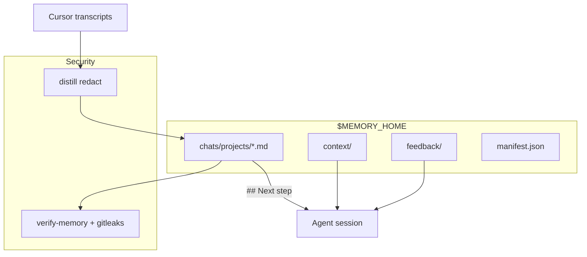

# Cursor Agent Memory

**Version:** 0.12.6 — see [VERSIONING.md](VERSIONING.md)
Created by [raphaelbatte](https://github.com/raphael-batte) · [raphbatte.com](https://raphbatte.com)

## What this is

**Cursor forgets between sessions.** One `@agent-memory` skill, a private hub outside the plugin bundle, and routed layers — not a notes dump.

- **Global context** — who you are, which projects, cross-repo rules, infra
- **Feedback** — what worked (+) and what to stop proposing (−)
- **Chat memory** — distilled transcripts + **`## Next step`** forward pointer (auto on hooks)
- **Security** — redact secrets on distill; `verify-memory` scans the hub (regex + optional gitleaks); CI runs gitleaks on every push

Agents load **one layer per task** (INDEX-first). Weak pointer → drill transcript via `[title](uuid)` in distill (never bulk jsonl).

**Cursor plugin** — code in the bundle; hub + anchor live **outside** it and survive updates. MIT license.

→ [ONBOARDING.md](ONBOARDING.md) · [ARCHITECTURE.md](ARCHITECTURE.md) · [INSTRUCTIONS.md](INSTRUCTIONS.md) · [MIGRATION.md](MIGRATION.md)

## Quick start

```bash
bash scripts/install-local.sh    # from your clone → ~/.cursor/plugins/local/agent-memory
```

**Reload Cursor** — first `sessionStart` creates hub + anchor. Then **`@agent-memory`** → **set up agent memory** (chat wizard).

Optional manual init:

```bash
bash scripts/init-memory.sh      # idempotent; custom MEMORY_HOME via env
```

In chat: **`@agent-memory`** → **sync with agent memory** (manual refresh anytime).

**New users:** [github.com/raphael-batte/cursor-agent-memory](https://github.com/raphael-batte/cursor-agent-memory) — clone, then `install-local.sh` above.

## Three locations

| Entity | Path | On plugin update |
|--------|------|------------------|
| **Bundle** | `~/.cursor/plugins/local/agent-memory/` | replaced |
| **Anchor** | `~/.cursor/agent-memory/config.json` | survives |
| **Hub** | from anchor (default `~/.cursor/agent-memory/`) | survives |

`MEMORY_HOME`: CLI `--memory-home` → env → anchor → default.

## How layers connect



| Layer | Location |
|-------|----------|
| Global context | `$MEMORY_HOME/context/` |
| Feedback | `feedback/`, `preferences.md` |
| Chat memory | `chats/projects/<slug>.md` |

## What's in the bundle

| Area | Contents |
|------|----------|
| Skill | `skills/agent-memory/SKILL.md` |
| Hooks | `hooks/hooks.json` — sessionStart, sessionEnd, preCompact |
| Scripts | distill, sync, verify, doctor, first-run |
| Templates | hub scaffolds (materialized into `$MEMORY_HOME`) |
| CI | tests, version-check, gitleaks; Release on `v*` tag |

**Tests:** `bash tests/run-tests.sh` (160+ checks).

## Common commands

```bash
python3 scripts/sync-memory.py --scan-only
python3 scripts/sync-memory.py --days 90 --limit 30
python3 scripts/memory-doctor.py --fix
python3 scripts/verify-memory.py --memory-home "$MEMORY_HOME"
bash scripts/migrate-memory.sh --from /old/hub --to "$MEMORY_HOME"
```

## Legacy cleanup

If you used symlink skills or global `~/.cursor/hooks.json` entries before the plugin — remove them to avoid double distill. See [MIGRATION.md](MIGRATION.md) §3.

## License

[MIT](LICENSE) — [CONTRIBUTING.md](CONTRIBUTING.md): PR → `main`.
